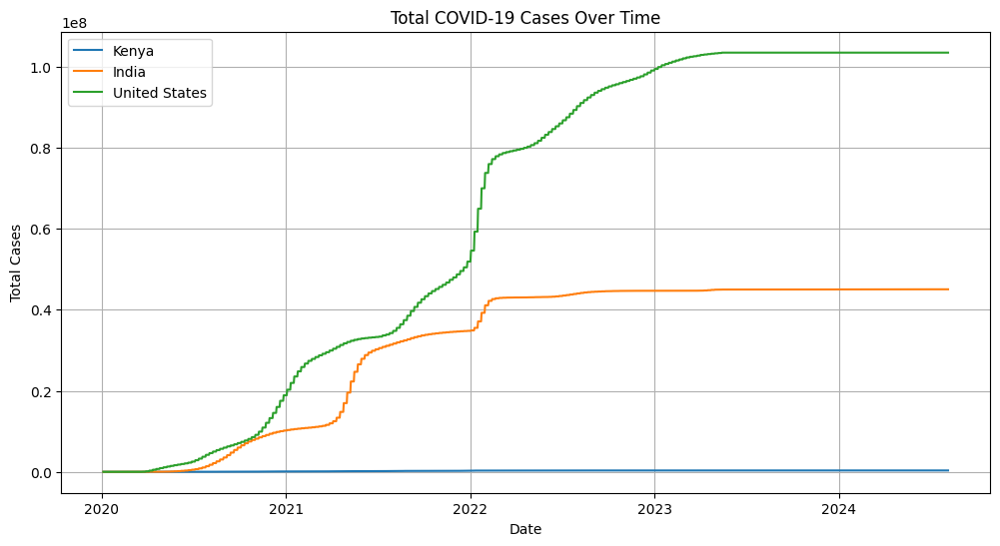
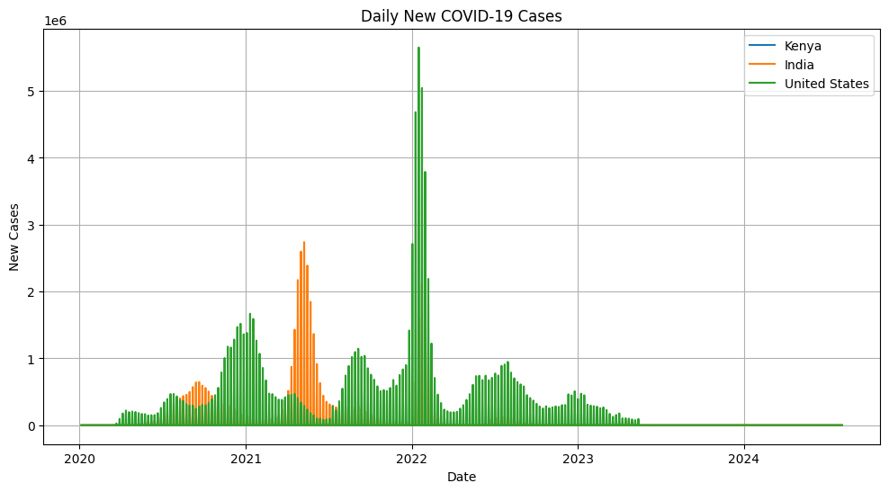
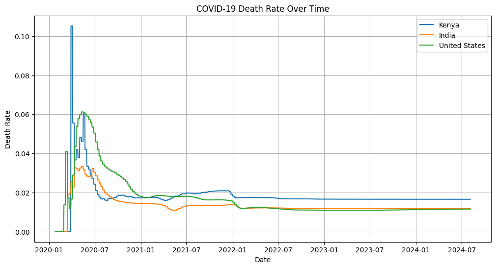
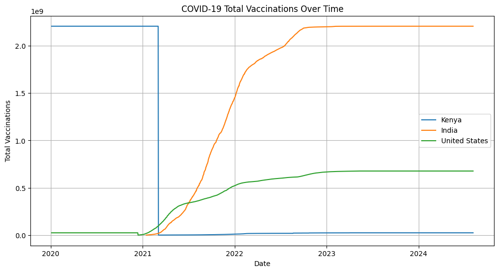
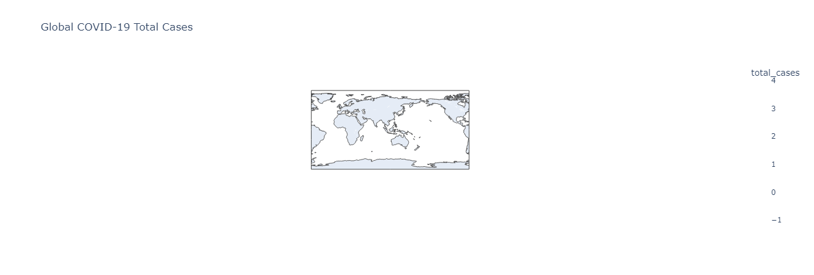

# COVID-19 Global Data Tracker 🌍

## Overview 📊
A comprehensive Python-based dashboard for visualizing and analyzing global COVID-19 data using the **Our World in Data (OWID)** dataset.

## Features 🚀
- **Real-time Data Collection** 
  - Automated loading of OWID dataset
  - Daily updates from reliable sources
  
- **Interactive Visualizations**
  - 📈 Total cases and deaths trends
  - 💉 Vaccination progress tracking
  - 🗺️ Global choropleth maps
  - 📊 Country-wise comparisons

## Quick Start 🏃‍♂️
1. Clone the repository:
```bash
git clone https://github.com/yourusername/covid19-tracker.git
cd covid19-tracker
```

2. Install dependencies:
```bash
pip install -r requirements.txt
```

3. Run the notebook:
```bash
jupyter notebook COVID19_Global_Data_Tracker.ipynb
```

## Project Structure 📁
```
COVID-19-Data-tracker/
├── COVID19_Global_Data_Tracker.ipynb
├── owid-covid-data.csv
├── requirements.txt
├── README.md
└── ASSETs/
    ├── cases.png
    ├── newcases.png
    ├── deaths.png
    ├── vaccinations.png
    └── plot.png
```

## Visualizations 📊

### 1. Total Cases Tracker

Track cumulative cases across different countries

### 2. Daily Cases Monitor

Monitor daily infection rates and trends

### 3. Mortality Analysis

Analyze death rates and patterns

### 4. Vaccination Progress

Track vaccination rollout globally

### 5. Global Impact Map

Interactive choropleth map of key metrics

## Code Examples 💻

### Loading Data
```python
import pandas as pd

# Load the dataset
df = pd.read_csv('owid-covid-data.csv')
print(df.head())
```

### Creating Visualizations
```python
import matplotlib.pyplot as plt

# Plot total cases
plt.figure(figsize=(12, 6))
for country in countries:
    data = df_filtered[df_filtered['location'] == country]
    plt.plot(data['date'], data['total_cases'], label=country)
plt.title('Total COVID-19 Cases Over Time')
plt.xlabel('Date')
plt.ylabel('Total Cases')
plt.legend()
plt.grid()
plt.show()
```

## Requirements 🛠️
- Python 3.x
- Key Libraries:
  - pandas >= 1.2.0
  - matplotlib >= 3.3.0
  - seaborn >= 0.11.0
  - plotly >= 4.14.0

## Data Source 📊
Data provided by [Our World in Data](https://covid.ourworldindata.org/data/owid-covid-data.csv)

## Contributing 🤝
1. Fork the repository
2. Create your feature branch
3. Commit your changes
4. Push to the branch
5. Open a Pull Request

## License 📝
MIT License - See [LICENSE](LICENSE) for details

## Acknowledgments 🙏
- Our World in Data team
- Contributing developers
- Open-source community